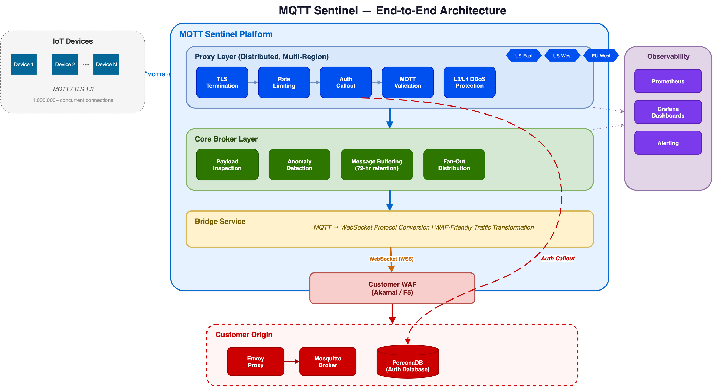

# MQTT Sentinel

**Distributed MQTT Security Platform — Protecting IoT at Scale**

MQTT Sentinel is a multi-layered security platform that protects MQTT deployments with distributed edge proxies, deep packet inspection, and seamless integration with existing WAF infrastructure. Designed for millions of concurrent device connections with real-time threat detection and total observability.

## Architecture



MQTT Sentinel operates as a transparent security layer between IoT devices and your origin infrastructure:

| Layer | Function |
|-------|----------|
| **Proxy Layer** | Distributed, multi-region edge proxies handling TLS termination, rate limiting, authentication, and MQTT protocol validation |
| **Core Broker** | Centralized message broker with payload inspection, anomaly detection, and 72-hour message buffering |
| **Bridge Service** | Protocol conversion from MQTT to WebSockets, enabling traffic to pass through existing WAF infrastructure |
| **Customer WAF** | Your existing Akamai or F5 WAF inspects WebSocket traffic before it reaches origin |
| **Customer Origin** | Envoy proxy fronting Mosquitto broker, with PerconaDB for device authentication |

## Key Benefits

| Benefit | Description |
|---------|-------------|
| **Distributed Security** | Proxy layer deployed multi-region, close to devices. Absorb attacks at the edge before they reach your origin. |
| **L3/L4 DDoS Protection** | Edge proxies absorb volumetric and protocol-level attacks with multi-tier rate limiting (global, per-IP, per-client, per-packet-type). |
| **Application Layer Protection** | MQTT 3.1.1 protocol validation at the proxy, plus deep payload inspection at the broker (SQL injection, XSS, command injection, path traversal detection). |
| **Origin Protection** | MQTT protocol converted to WebSockets by the Bridge Service, making all traffic inspectable by your existing WAF (Akamai / F5). No direct MQTT exposure to origin. |
| **Total Observability** | Prometheus metrics and Grafana dashboards across all layers — proxy connections, rate limit events, auth results, inspection findings, and bridge throughput. |
| **Performance & Scale** | 1,000,000+ concurrent connections, sub-50ms message delivery (P99), 72-hour message retention with 3x replication. |

## Detailed Diagrams

| Diagram | Description |
|---------|-------------|
| [Architecture Overview](diagrams/mqtt-sentinel-architecture.drawio) | End-to-end flow from devices through Sentinel to customer origin |
| [Proxy Layer Detail](diagrams/proxy-layer-detail.drawio) | TLS termination, rate limiting pipeline, auth callout, MQTT validation |
| [Security Inspection](diagrams/security-inspection.drawio) | Pattern matching, anomaly detection, message buffering pipeline |
| [Bridge & Origin](diagrams/bridge-and-origin.drawio) | MQTT-to-WebSocket conversion, WAF integration, customer origin |

## Demo

### Prerequisites

- `mosquitto-clients` package installed (`brew install mosquitto` on macOS)
- Network access to the MQTT Sentinel cluster
- Grafana dashboard access

### Live Demo Walkthrough

Run the interactive demo script that walks through each capability:

```bash
./demo/scripts/demo-walkthrough.sh
```

This demonstrates:
1. Platform health and connection metrics
2. Device authentication (valid + invalid credentials)
3. Rate limiting under burst traffic
4. Security inspection catching malicious payloads
5. Grafana dashboard visualization
6. Scale metrics

### Traffic Simulation

Generate continuous bad traffic to visualize security events in Grafana:

```bash
# Run all attack types in a loop
./demo/scripts/simulate-bad-traffic.sh

# Run specific attack type
./demo/scripts/simulate-bad-traffic.sh --mode auth-flood
./demo/scripts/simulate-bad-traffic.sh --mode injection
./demo/scripts/simulate-bad-traffic.sh --mode connection-flood
./demo/scripts/simulate-bad-traffic.sh --mode size-anomaly
```

### Security Scenario Injection

Run discrete security test scenarios:

```bash
./demo/scripts/inject-security.sh [SCENARIO]
# Scenarios: all, auth-failure, rate-anomaly, pattern-violation, size-anomaly, entropy
```

### Load Testing

Subscriber fan-out load test using Locust:

```bash
cd demo/loadtest
pip install -r requirements.txt
locust -f locustfile.py --host=mqtts://mqtt.connected-cloud.io:30883
```

## Documentation

- [Architecture Details](docs/architecture.md) — Detailed system design with proxy, broker, bridge, and origin layers
- [Security Features](docs/security-features.md) — Threat detection capabilities across all layers

## Dashboards

### Sentinel Health Dashboard
- Connected device count across all proxy regions
- Message throughput and fan-out delivery rate
- Auth latency (P50, P95, P99)
- Message retention and buffer utilization
- Cluster health status

### Sentinel Security Dashboard
- Threat score indicator
- Rate limit rejections by tier (global, per-IP, per-client)
- Authentication failures per minute
- Pattern violations detected (SQLi, XSS, command injection)
- Anomaly events (rate, size, entropy)
- Security event log (50 most recent)

## Performance

| Metric | Target |
|--------|--------|
| Concurrent Connections | 1,000,000+ |
| Message Throughput | 600+ msg/sec |
| Auth Latency (P99) | < 10ms |
| Message Delivery (P99) | < 50ms |
| Availability | 99.99% |
| Message Retention | 72 hours |

## License

Apache License 2.0 — See [LICENSE](LICENSE) for details.
