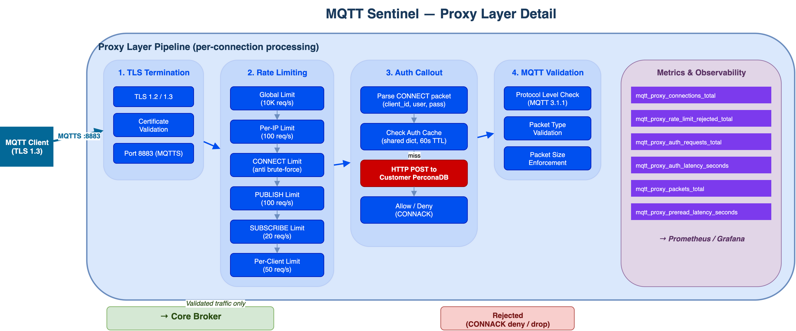
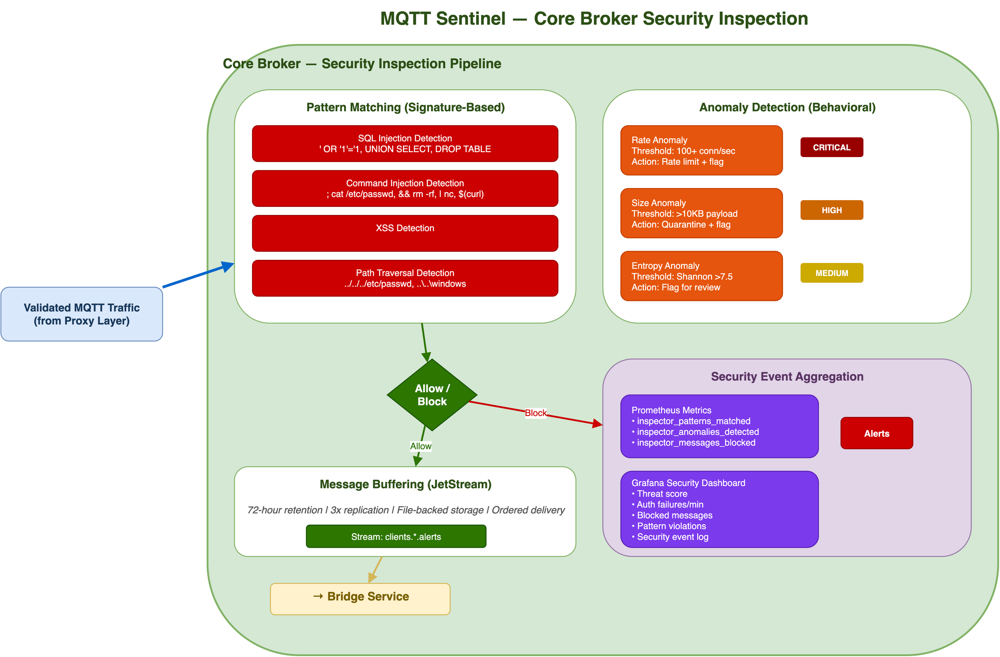
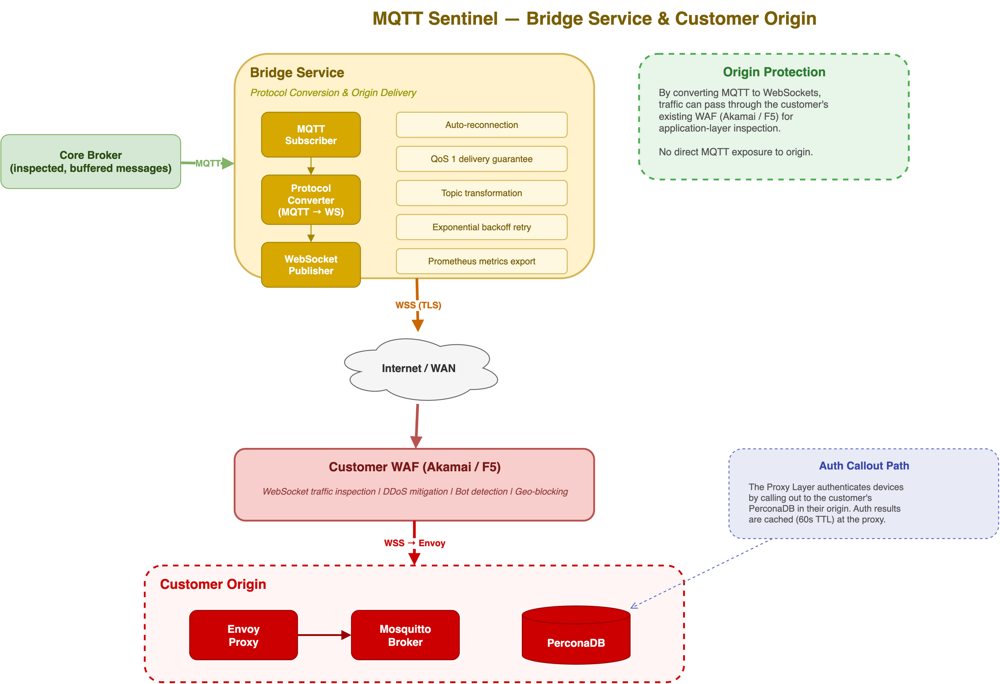

# MQTT Sentinel Architecture

## Overview

MQTT Sentinel is a multi-layered security platform that sits between IoT devices and customer origin infrastructure. It provides distributed edge security, deep packet inspection, and origin protection by converting MQTT traffic to WAF-friendly WebSockets.

The architecture consists of platform-level network security plus four distinct application layers, each with a specific security and operational role.

## End-to-End Architecture


## Platform-Level Network Security

Before traffic reaches any MQTT Sentinel component, it is protected by infrastructure-level network security provided by the Linode compute platform.

### Region-Level DDoS Protection

Every Linode region includes always-on DDoS mitigation at the network edge. Volumetric attacks (UDP/ICMP floods, amplification), protocol-level attacks (SYN floods, fragmented packets), and network-layer anomalies are detected and dropped before reaching compute instances. This protection is automatic with no configuration or performance impact during normal operation.

### Akamai Prolexic Routed On-Demand

For sustained or large-scale network-layer attacks, Akamai Prolexic routed on-demand provides additional scrubbing capacity:

| Aspect | Detail |
|--------|--------|
| Activation | On-demand — traffic rerouted to scrubbing centers when attack detected |
| Scrubbing | Network-layer inspection at Prolexic's globally distributed scrubbing centers |
| Return Path | Clean traffic returned to Linode region via GRE tunnels |
| Capacity | Multi-terabit attack absorption |
| Coverage | All platform IP space used by MQTT Sentinel proxy and broker instances |

Together, region-level DDoS and Prolexic handle network-layer (L3/L4) volumetric attacks at the infrastructure edge, before the MQTT Sentinel application layers handle protocol-specific security.

## Layer 1: Proxy Layer (Distributed, Multi-Region)



The proxy layer is the first point of contact for IoT devices. It is deployed as a distributed fleet of edge proxies across multiple regions, placing security enforcement as close to devices as possible.

### TLS Termination

- Accepts MQTT connections on port 8883 (MQTTS)
- Supports TLS 1.2 and TLS 1.3
- Offloads encryption overhead from the core broker
- Certificate-based device identity validation

### Multi-Tier Rate Limiting

Rate limiting operates at six levels, evaluated in order. If any tier rejects a request, it is dropped immediately.

| Tier | Scope | Default Rate | Default Burst | Purpose |
|------|-------|-------------|---------------|---------|
| Global | All traffic | 10,000 req/s | 5,000 | Platform-wide DDoS protection |
| Per-IP | Source IP | 100 req/s | 1,000 | Prevent single-source floods |
| CONNECT | Source IP | 10 req/s | 500 | Anti brute-force on authentication |
| PUBLISH | Client ID | 100 req/s | 500 | Message flood prevention |
| SUBSCRIBE | Client ID | 20 req/s | 500 | Subscription abuse prevention |
| Per-Client | Client ID | 50 req/s | 500 | Per-device overall limit |

**Rejection behavior** varies by packet type:
- CONNECT packets receive a CONNACK with return code 0x05 (Not Authorized)
- QoS 0 PUBLISH packets are dropped silently
- QoS 1+ PUBLISH packets receive no PUBACK (client retries)
- SUBSCRIBE packets receive SUBACK with failure code 0x80

All rate limits are configurable via environment variables for tuning per deployment.

### Authentication Callout

The proxy authenticates devices by calling out to the customer's PerconaDB:

1. Client sends MQTT CONNECT packet with `client_id`, `username`, `password`
2. Proxy parses the CONNECT packet and extracts credentials
3. Proxy checks local auth cache (shared memory, 60-second TTL)
4. On cache miss, proxy makes an HTTP POST to the customer's auth endpoint
5. Auth endpoint queries PerconaDB and returns allow/deny
6. Result is cached and a CONNACK is sent to the client

The auth callout is fail-closed: if the auth service is unreachable, connections are denied.

### MQTT Protocol Validation

The proxy parses MQTT 3.1.1 packets and enforces protocol correctness:

- Protocol name must be "MQTT" with protocol level 4
- First packet must be CONNECT
- Remaining length field validated (1-4 byte variable encoding)
- Packet type validated (types 1-14)
- Required fields checked per packet type

Invalid packets are rejected before reaching the core broker.

### L3/L4 DDoS Protection

The distributed proxy fleet absorbs volumetric attacks:
- TCP SYN flood mitigation via connection limits
- Bandwidth throttling per source IP
- Geographic distribution means attacks target a regional proxy, not the origin
- Proxy fleet scales horizontally by adding nodes

## Layer 2: Core Broker



The core broker handles message routing, deep inspection, and durable storage. Only validated traffic from the proxy layer reaches this tier.

### Payload Inspection

All message payloads pass through the security inspection pipeline:

**Pattern Matching (Signature-Based)**

| Threat | Example Pattern | Severity | Action |
|--------|----------------|----------|--------|
| SQL Injection | `' OR '1'='1`, `UNION SELECT` | High | Block |
| Command Injection | `; cat /etc/passwd`, `&& rm -rf` | Critical | Block |
| XSS | `<script>`, `javascript:` | High | Block |
| Path Traversal | `../../../etc/passwd` | High | Block |

**Anomaly Detection (Behavioral)**

| Anomaly Type | Baseline | Threshold | Action |
|--------------|----------|-----------|--------|
| Rate | Normal client rate | 100+ conn/sec | Rate limit + flag |
| Payload Size | Expected message size | > 10KB | Quarantine + flag |
| Entropy | Normal text entropy | Shannon > 7.5 | Flag for review |

Blocked messages are logged to the security event aggregator. Allowed messages proceed to buffering.

### Message Buffering

Messages are durably stored with configurable retention:

- **Retention**: 72 hours (configurable)
- **Replication**: 3x across broker nodes
- **Storage**: File-backed for persistence across restarts
- **Ordering**: Ordered delivery per topic
- **Topic pattern**: `clients/{client_id}/alerts`

### Fan-Out Distribution

The broker efficiently distributes messages to subscribers:
- Each device subscribes to its own topic (`clients/{client_id}/alerts`)
- Fan-out from a single publisher to millions of per-device topics
- Messages are routed through the broker cluster to the appropriate subscriber connections

## Layer 3: Bridge Service



The Bridge Service connects the core broker to the customer's origin infrastructure. Its primary function is protocol conversion.

### MQTT to WebSocket Conversion

The bridge subscribes to messages on the core broker (MQTT) and republishes them to the customer origin over WebSockets (WSS). This conversion serves a critical security purpose: **WebSocket traffic can be inspected by the customer's existing WAF (Akamai / F5), while raw MQTT traffic cannot.**

Key features:
- Bidirectional protocol conversion
- QoS 1 delivery guarantee
- Topic transformation between internal and customer topic structures
- Auto-reconnection with exponential backoff
- Prometheus metrics for bridge throughput and latency

### WAF Compatibility

By transforming MQTT to WebSockets:
- Traffic passes through the customer's Akamai or F5 WAF
- WAF applies its own inspection rules to WebSocket frames
- Bot detection, geo-blocking, and rate limiting at the WAF layer
- No direct MQTT protocol exposure to the customer origin

## Customer Origin

The customer's existing infrastructure receives clean, inspected WebSocket traffic:

| Component | Role |
|-----------|------|
| **Akamai / F5 WAF** | Application-layer WebSocket inspection, DDoS mitigation |
| **Envoy Proxy** | Reverse proxy, load balancing, TLS termination for origin |
| **Mosquitto Broker** | Customer's MQTT broker for internal message distribution |
| **PerconaDB** | Device credential database (auth callout target from proxy layer) |

## Multi-Region Deployment

The proxy layer supports multi-region deployment for geographic distribution:

```
                    ┌─────────────────┐
                    │   Core Broker   │
                    │   (Central)     │
                    └────────┬────────┘
                             │
         ┌───────────────────┼───────────────────┐
         │                   │                   │
         v                   v                   v
   ┌───────────┐      ┌───────────┐      ┌───────────┐
   │  Proxy    │      │  Proxy    │      │  Proxy    │
   │ (US-East) │      │ (US-West) │      │ (EU-West) │
   └───────────┘      └───────────┘      └───────────┘
         ^                   ^                   ^
         │                   │                   │
     Devices             Devices             Devices
```

- Each region has its own proxy fleet for low-latency TLS termination
- Auth callout is cached locally, reducing cross-region latency
- Core broker handles routing and persistence centrally
- Bridge Service connects to customer origin from the core tier

## Traffic Flow Summary

1. **Network traffic enters** Linode region — region-level DDoS drops volumetric/protocol-level attacks; Prolexic activates on-demand for large-scale events
2. **Device connects** to nearest regional proxy on port 8883 (MQTTS)
3. **Proxy terminates TLS** and parses the MQTT CONNECT packet
4. **Rate limiter checks** global, per-IP, and CONNECT-specific limits
5. **Auth callout** validates credentials against customer's PerconaDB
6. **MQTT validation** confirms protocol correctness
7. **Core broker receives** validated traffic for deep inspection
8. **Payload inspection** checks for injection attacks and anomalies
9. **Message buffered** in durable storage (72-hour retention)
10. **Bridge converts** MQTT messages to WebSocket frames
11. **Customer WAF** (Akamai/F5) inspects WebSocket traffic
12. **Origin receives** clean traffic via Envoy into Mosquitto

## Observability

Prometheus metrics are exported from every layer:

| Layer | Key Metrics |
|-------|-------------|
| Proxy | `mqtt_proxy_connections_total`, `mqtt_proxy_rate_limit_rejected_total`, `mqtt_proxy_auth_requests_total`, `mqtt_proxy_auth_latency_seconds` |
| Broker | `inspector_patterns_matched`, `inspector_anomalies_detected`, `inspector_messages_blocked` |
| Bridge | `bridge_messages_ingested`, `bridge_messages_persisted`, `bridge_latency_seconds` |

Grafana dashboards provide real-time visibility into:
- System health (connections, throughput, latency percentiles)
- Security events (threats detected, auth failures, rate limit triggers)

## Performance Characteristics

| Metric | Target |
|--------|--------|
| Concurrent Connections | 1,000,000+ |
| Message Throughput | 600+ msg/sec |
| Auth Latency (P99) | < 10ms |
| Message Delivery (P99) | Regional: < 50ms, Cross-region: < 200ms |
| Availability | 99.99% |
| Message Retention | 72 hours |
